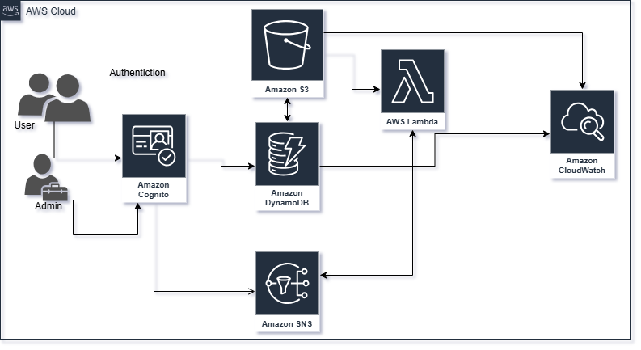

# TechiVS: An Electronic Product Comparison Application

TechiVS is a cloud-based **Django** application for comparing two or three electronic products (mobiles, laptops, televisions and more) side by side. It shows specifications, prices, competitor listings and user reviews in one place, so shoppers can decide without visiting several shops or sites. It is built on AWS with a custom, published Python library that handles the comparison logic.

## Table of Contents

- [Features](#features)
- [Architecture](#architecture)
- [Tech Stack](#tech-stack)
- [AWS Services](#aws-services)
- [Comparison Library](#comparison-library)
- [External API](#external-api)
- [Data Model](#data-model)
- [Getting Started](#getting-started)
- [CI/CD Pipeline](#cicd-pipeline)

## Features

### Users
- Sign up with username, email and password (minimum 8 characters, with upper case, lower case and a number)
- Email **verification code** required before login
- After verification, an **SNS subscription email** is sent, so users are notified when new products are added
- Search products by features and brand name
- View **similar products** by product name
- **Compare 2 or 3 products** side by side
- View competitor prices, source and rating through an external shopping API
- Add reviews and ratings, and read reviews from other users

### Admin
- Full **CRUD** on electronic products (with features in JSON and a product image)
- Monitor AWS services through a **CloudWatch** dashboard

## Architecture



## Tech Stack

| Area | Technology |
|---|---|
| Backend | Django (Python 3.9), Boto3 |
| Authentication | Amazon Cognito (user pool, app client, Admin/User groups, JWT) |
| Database | Amazon DynamoDB |
| Storage | Amazon S3 (presigned URLs for images) |
| Serverless | AWS Lambda, Amazon SNS |
| Monitoring | Amazon CloudWatch |
| External API | SerpApi (Google Shopping) |
| Visualisation | Chart.js |
| Hosting | AWS Elastic Beanstalk (Python 3.9 on Amazon Linux 2023) |
| CI/CD | GitHub Actions |

## AWS Services

| Service | Role in TechiVS |
|---|---|
| **Cognito** | User and admin sign-up, verification code, login and JWT tokens. The user pool enforces the password policy and stores username and user ID, which are used to show reviewer names. |
| **DynamoDB** | Stores product metadata (price, spec score, features) and reviews. Admin CRUD and user search read from it. |
| **S3** | Stores product images keyed by product ID. The app generates a temporary presigned URL to display an image. |
| **Lambda** | Triggered by an S3 upload event. Lists verified users' emails from Cognito and publishes a notification to SNS. |
| **SNS** | Sends the subscription email after verification and "new product added" emails to subscribers. |
| **CloudWatch** | Dashboard with the number of S3 objects and DynamoDB consumed read capacity units. |
| **Elastic Beanstalk** | Hosts the Django application. |

## Comparison Library

The comparison logic is packaged as a reusable Python library, published on PyPI as **`Ele-Product-compare-chaitali`**.

```bash
pip install Ele-Product-compare-chaitali
```

DynamoDB returns nested JSON with type annotations (`S`, `N`, `BOOL`), which is hard to compare directly. The library:

| Function / class | Purpose |
|---|---|
| `fetch_products_by_ids(table_name, product_ids, region)` | Queries DynamoDB for the selected products |
| `normalize_product` | Recursively flattens nested data and removes type annotations (`{"S": "Laptop"}` becomes `"Laptop"`) |
| `normalize_features` | Trims whitespace and standardises feature keys and values (`" RAM "` becomes `"ram"`) |
| `ProductComparator` | Takes product IDs and categories, fetches and normalises the data, and `compare_features()` returns a structured list of attributes and values across products |

Example use in a Django view:

```python
from Ele_Product_compare_chaitali.compare_products import ProductComparator  # check the exact module path

def compare_products(request):
    if request.method == "POST":
        product_ids = request.POST.getlist("product_ids")
        ids = [pid.split(":") for pid in product_ids]      # (category, productid)
        comparator = ProductComparator(product_ids=ids)
        rows = comparator.compare_features()
```

## External API

`fetch_google_shopping` calls **SerpApi** (Google Shopping engine) with a search term, location, language and domain, and returns compact JSON with competitor prices, availability, source and rating. Only key product data is returned, which keeps responses fast and light.

> Keep the SerpApi key in an environment variable, not in the repository.

## Data Model

**DynamoDB table `ElectronicItem`**

| Attribute | Type | Notes |
|---|---|---|
| `category` | String | Partition key |
| `productid` | String | Sort key |
| `price` | Number | |
| `specscore` | Number | |
| `features` | Map (JSON) | Specifications such as RAM, weight, model version |
| `reviews` | List of maps | User ID, username, rating and comment |


## Getting Started

### Prerequisites

- Python 3.9+
- An AWS account (region `us-east-1`) with credentials configured for Boto3
- A SerpApi key
- EB CLI (`pip install awsebcli`)

### 1. Clone and install

```bash
git clone <your-repository-url>
cd <repo>
python -m venv env && source env/bin/activate
pip install -r requirements.txt
```

### 2. Create the AWS resources

Run the setup scripts (or create the resources in the console):

1. **Cognito:** user pool (email auto-verified, password policy min length 8 with upper and lower case and numbers), app client, and `Admin` and `User` groups.
2. **DynamoDB:** table `ElectronicItem` with partition key `category` and sort key `productid`.
3. **S3:** bucket for product images (keep it private and use presigned URLs).
4. **SNS:** topic `UserNotification`.
5. **Lambda:** deploy the function, add the S3 upload event as its trigger, and grant it access to Cognito (`ListUsers`) and SNS (`Publish`).
6. **CloudWatch:** create the dashboard for S3 object count and DynamoDB read capacity.

### 3. Configure environment variables

```bash
AWS_REGION=us-east-1
COGNITO_USER_POOL_ID=<user-pool-id>
COGNITO_CLIENT_ID=<app-client-id>
DYNAMODB_TABLE=ElectronicItem
S3_BUCKET=<bucket-name>
SNS_TOPIC_ARN=<topic-arn>
SERPAPI_KEY=<your-serpapi-key>
```

### 4. Run locally

```bash
python manage.py migrate
python manage.py runserver
```

Open <http://127.0.0.1:8000/>, sign up, verify with the emailed code, then log in.

## CI/CD Pipeline

A GitHub Actions workflow named **"electronic compare"** deploys automatically on a **push to `main`** or a **merged pull request into `main`**.

Steps: checkout (`actions/checkout@v4`) → set up Python 3.9 (`actions/setup-python@v4`) → install the EB CLI → configure AWS credentials from secrets → `eb deploy` with the label `deploy-<github.run_id>`, targeting Elastic Beanstalk on Python 3.9 / Amazon Linux 2023.

Required **GitHub Secrets**: `AWS_ACCESS_KEY_ID`, `AWS_SECRET_ACCESS_KEY`, `AWS_SESSION_TOKEN`, `AWS_REGION`, `EB_APP_NAME`, `EB_ENV_NAME`.

Each deployment is tagged with its GitHub Actions run ID, giving traceability for debugging and rollback.
